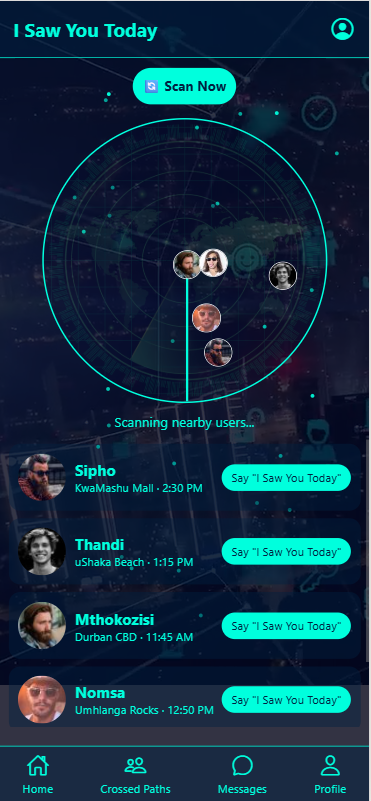
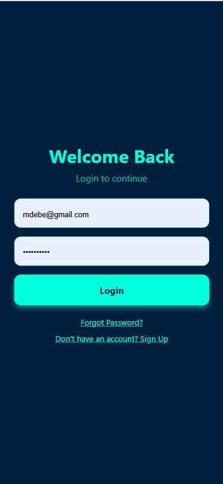
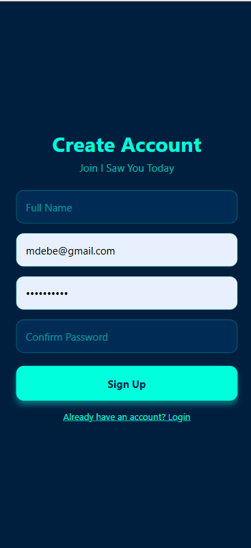

# I Saw You Today

**I Saw You Today** is a social networking app that lets users see people they crossed paths with in real life. It combines a modern, interactive UI with real-time location tracking and social interactions.

---

## 📱 Features

- **Crossed Paths Radar:** Animated radar showing nearby users.
- **Activity Feed:** View recent interactions and encounters.
- **Quick Actions:** Scan nearby users, open messages.
- **Profile Management:** View and edit your profile.
- **Realtime Location Detection:** Tracks users and logs encounters.
- **Supabase Backend:** Stores user data, encounters, and locations.

---

## 🖼️ Screenshots

**Home Screen**  


**Crossed Paths Screen**  


**Login Screen**  


**Sign Up Screen**  


---

## ⚙️ Tech Stack

- **Frontend:** React Native + Expo
- **Backend:** Supabase (PostgreSQL)
- **Location Tracking:** Expo Location API
- **Animations:** React Native Animated API
- **Video & Media:** Expo AV

---

## 🚀 Installation

1. Clone the repository:

```bash
git clone https://github.com/<your-username>/i-saw-you-today.git
cd i-saw-you-today
